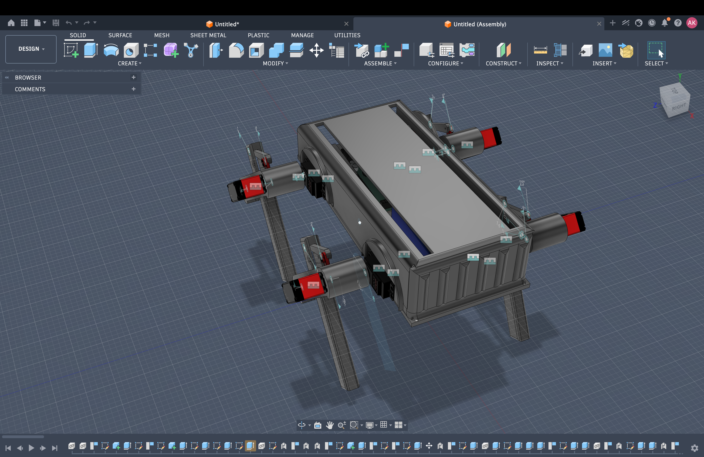
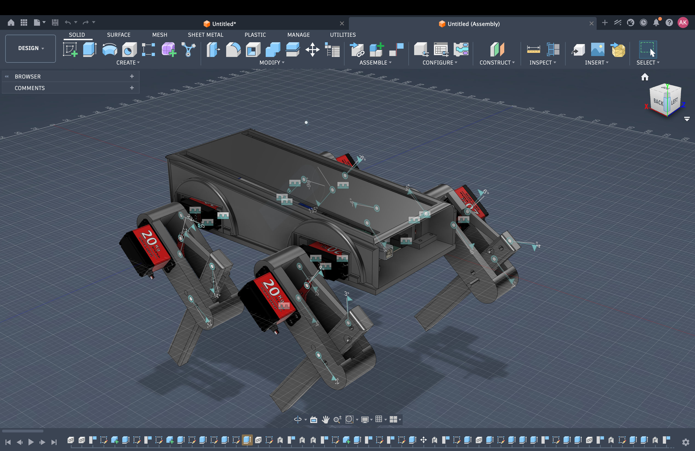

# RoboDog (8 Servos Quadruped)

## Introduction

The project is a quadruped robot which is used for **a stasis project (engineering project)**. In the process, 8 **high torque servos (20 kg class)** will be used for stable movements.

Included elements:

* Design mechanical CAD files (Fusion 360, STL files)
* Electronics design and integration
* Energy systems
* Images

---
## Bill of Materials (BOM)

| Name         | Purpose                                 | Quantity | Total Cost (USD) | Link                                                                                             | Supplier    |
| ------------ | --------------------------------------- | -------- | ---------------- | ----------------------------------------------------------------------------------------------- | ---------- |
| Battery      | Source of energy for whole the device   | 1        | 15.00            | https://robu.in/product/orange-transmitter-tx-2500mah-2s-3c7-4v-lithium-polymer-battery-pack-lipo | Robu        |

> ⚠️ Please note that other materials, servos, etc., are omitted due to their availability.

---
## Images

### Image 1



### Image 2



---
## CAD File Structure

### Design files folder is situated in 

```
/cad/robodog
```

### Design file formats:

* `.f3z` -> editable CAD file format
* `.stl` -> format for printing 3D objects

---
## Assembly Process

1. **3D Print Parts**

   * Use STL format for all structural pieces.
   * Preferred material: PLA or PETG.

2. **Mounting Servos**

   * Mount 8 servos (2 per limb).
   * Make sure to align properly.

3. **Construct Frame**

   * Link all limbs to central body frame.
   * Tighten all joints using screws.

4. **Electrical Connections**

   * Connect all servos to motor control board.
   * Attach power source.

5. **Initial Tests**

   * Fine-tune angle settings.
   * Perform walk tests.

---

## Power Supply

* **Battery:** 7.4V LiPo (2S, 2500mAh)
* Supplies adequate current to all 8 servos.

---

## Characteristics

* 8 DOF (Degrees of Freedom)
* Large torque (20kg servos)
* Modular construction
* 3D printed structure

---

## Directory Structure

```
.
├── cad/
│   └── robodog/
│       ├── design.f3z
│       ├── parts.stl
├── images/
│   ├── image1.png
│   ├── image2.png
├── README.md
```

---

## Safety Considerations

* Avoid discharging LiPo battery completely
* Proper servo current handling is important
* Joint stress must be avoided

---

## Potential Enhancements

* Incorporate IMU for stability
* Autonomously controlled walking
* Brushless actuator upgrade