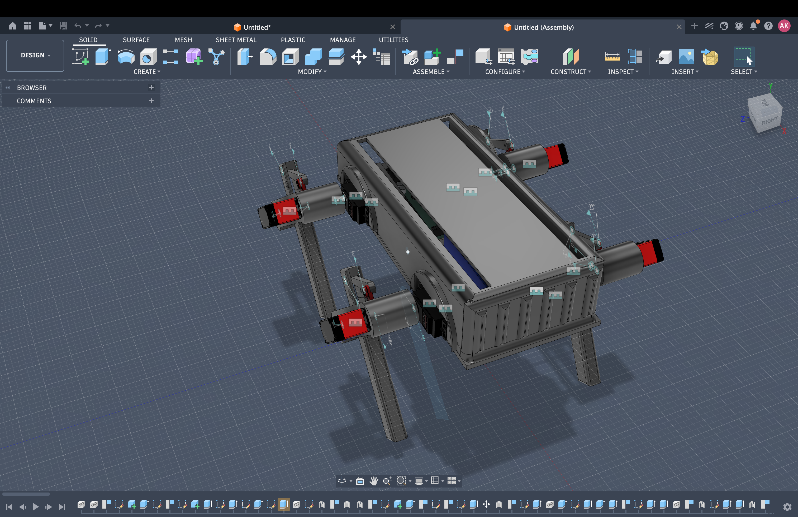
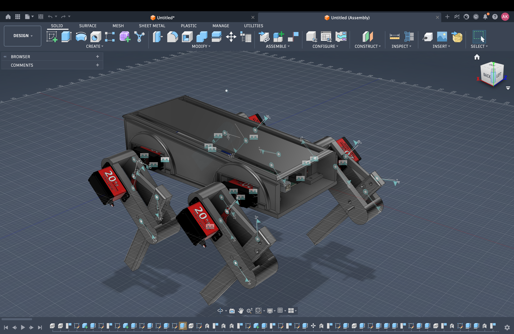

# RoboDog (8 Servos Quadruped)


## Motivation

The goal of this project is to design and build a low-cost quadruped robot using commonly available components and 3D-printed parts. The robot serves as an engineering project focused on mechanical design, embedded systems, CAD modeling, and robotics.

The project was designed to be simple enough for students and hobbyists to reproduce while still demonstrating key concepts such as servo control, gait generation, power distribution, and robot assembly.

---

## Introduction

RoboDog is a simple 8-servo quadruped robot made for an engineering project.  
It uses high-torque servos for walking and a basic control setup for movement.

This project includes:

- Mechanical CAD files
- STL files for 3D printing
- Electronics and wiring
- Power system
- Images
- Wiring diagram

---

## Bill of Materials (BOM)

| Name | Purpose | Quantity | Total Cost (USD) | Link | Supplier |
| --- | --- | ---: | ---: | --- | --- |
| LiPo Battery 7.4V 2500mAh | Main power source | 1 | 15.00 | https://robu.in/product/orange-transmitter-tx-2500mah-2s-3c7-4v-lithium-polymer-battery-pack-lipo | Robu |
| 30KG Servo Motor | Main leg movement | 8 | 96.00 | https://robu.in/ | Robu |
| Arduino Board | Main controller | 1 | 8.00 | https://robu.in/ | Robu |
| PCA9685 Servo Driver | Controls all servos | 1 | 5.00 | https://robu.in/ | Robu |
| RC Transmitter | Remote control | 1 | 25.00 | https://robu.in/ | Robu |
| RC Receiver | Receives remote commands | 1 | 12.00 | https://robu.in/ | Robu |
| 5V UBEC | Regulates power for electronics | 1 | 8.00 | https://robu.in/ | Robu |
| Power Switch | Turns robot on/off | 1 | 1.00 | https://robu.in/ | Robu |
| XT60 Connector Set | Battery connection | 1 | 2.00 | https://robu.in/ | Robu |
| Jumper Wires | Basic wiring | 1 set | 3.00 | https://robu.in/ | Robu |
| Servo Extension Cables | Servo wiring extension | 8 | 4.00 | https://robu.in/ | Robu |
| Prototype PCB | Small mounting board | 1 | 2.00 | https://robu.in/ | Robu |
| M3 Screw Kit | Assembly hardware | 1 set | 5.00 | https://robu.in/ | Robu |
| Ball Bearings | Smoother joints | 8 | 8.00 | https://robu.in/ | Robu |
| 3D Printed Frame | Robot body and legs | 1 | 30.00 | N/A | Local 3D Printing Service |
| Rubber Feet | Better grip on surface | 4 | 2.00 | https://robu.in/ | Robu |
| Battery Charger | Charges LiPo battery | 1 | 10.00 | https://robu.in/ | Robu |

**Estimated Total Cost:** **$236.00**

> This BOM includes the main parts needed to build the robot from scratch.

---

## Images

### Image 1



### Image 2



---

## Wiring Diagram


---
## Features

* 8 DOF quadruped design
* ESP32-based control system
* PCA9685 servo driver
* 3D printed frame
* Remote control operation
* Modular and easy-to-modify design
* Fusion 360 source files included

## Repository Structure

```text
.
├── cad/
│   ├── robodog.f3z
│   ├── robodog.step
│   └── robodog.stl
│
├── image/
│   ├── image1.png
│   └── image2.png
│
├── Robo Dog-bom.csv
├── main.cpp
├── readme.md
└── LICENSE (optional)
```

### Folder Description

#### cad/

Contains the CAD and manufacturing files for the robot.

* `robodog.f3z` - Fusion 360 project file
* `robodog.step` - Universal CAD exchange file
* `robodog.stl` - 3D printable model

#### image/

Contains project images used in the documentation.

* `image1.png`
* `image2.png`

#### Robo Dog-bom.csv

Complete Bill of Materials (BOM) used for the project.

#### main.cpp

Source code for the ESP32 controller.

#### readme.md

Project documentation, build instructions, images, and hardware information.

```
```


